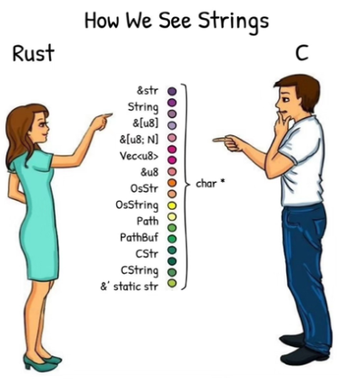

- [1. Rust 入门导学](#1-rust-入门导学)
  - [1.1. Rust 语言的主要特点](#11-rust-语言的主要特点)
  - [1.2. Rust 语言的基本类型和基本运算符](#12-rust-语言的基本类型和基本运算符)
    - [基础数据类型 - 整数、浮点数](#基础数据类型---整数浮点数)
    - [基础数据类型 - 布尔型](#基础数据类型---布尔型)
    - [基础数据类型 - 字符 Char](#基础数据类型---字符-char)
    - [基础数据类型 - 元组 Tuple](#基础数据类型---元组-tuple)
    - [基础数据类型 - 数组 Array](#基础数据类型---数组-array)
  - [1.3. Rust 语言的控制结构](#13-rust-语言的控制结构)
    - [控制结构 - 函数代码块](#控制结构---函数代码块)
    - [控制结构 - If 表达式](#控制结构---if-表达式)
    - [控制结构 - 无条件循环(死循环)](#控制结构---无条件循环死循环)
    - [控制结构 - While 循环](#控制结构---while-循环)
    - [控制结构 - For 迭代](#控制结构---for-迭代)
    - [Cargo 时间](#cargo-时间)
  - [1.4. Rust 语言的字符串](#14-rust-语言的字符串)
    - [字符串: &str](#字符串-str)
    - [字符串: String](#字符串-string)
    - [字符串 More](#字符串-more)
    - [Slice](#slice)
  - [1.5. Rust 语言的枚举与模式匹配](#15-rust-语言的枚举与模式匹配)
    - [复合类型 - 结构体](#复合类型---结构体)
    - [复合类型 - 枚举](#复合类型---枚举)
  - [1.6. Rust 语言的 Result 与 Option](#16-rust-语言的-result-与-option)
    - [Rust 中无空值](#rust-中无空值)
  - [1.7. Rust 语言的错误处理](#17-rust-语言的错误处理)
    - [错误处理示例](#错误处理示例)
  - [1.8. Rust 语言的所有权与生命周期的概念](#18-rust-语言的所有权与生命周期的概念)
    - [Ownership 和 Borrowing](#ownership-和-borrowing)
    - [生命周期](#生命周期)
    - [生命周期管理的实现](#生命周期管理的实现)
  - [1.9. Rust 语言的 Trait](#19-rust-语言的-trait)
    - [定义一个 trait](#定义一个-trait)
    - [为一个结构体实现这个 trait](#为一个结构体实现这个-trait)
    - [为另一个结构体实现这个 trait](#为另一个结构体实现这个-trait)
    - [使用 trait 中实现的方法](#使用-trait-中实现的方法)
    - [Trait Bound 特征限定](#trait-bound-特征限定)
  - [1.10. Rust 语言的泛型](#110-rust-语言的泛型)
    - [两个范型示例](#两个范型示例)
  - [1.11. Rust 语言的迭代器](#111-rust-语言的迭代器)
    - [Std 标准库定义的 Iterator Trait](#std-标准库定义的-iterator-trait)
    - [实现一个自己的迭代器](#实现一个自己的迭代器)
    - [使用自己实现的迭代器](#使用自己实现的迭代器)
  - [1.12. Rust 语言的宏](#112-rust-语言的宏)
    - [Substrate 中的宏 - 声明宏示例](#substrate-中的宏---声明宏示例)
    - [Substrate 中的宏 - 过程宏示例](#substrate-中的宏---过程宏示例)
# 1. Rust 入门导学


## 1.1. Rust 语言的主要特点
* 高性能
    * 与 C/C++ 一个级别的运行速度
    * 方法抉择
        * Zero Cost Abstract 零开销抽象
        * 无 GC 的自动内存管理 RAII
        * 可做到 C ABI 一致的设计
* 内存安全
    * 使用 Rust (非 unsafe 部分)写出来的代码，保证内存安全
    * 方法抉择
        * Ownership, move 语义
        * Borrowchecker
        * 强类型系统
        * 无空值( Null, nil 等)设计
* 无忧并发(程序的开发)
    * 使用 Rust 进行多线程以及多任务并发代码开发，不会出现 数据竞争和临界值破坏
    * 方法抉择
        * 对并发进行了抽象 Sync, Send
        * 融入类型系统
        * 基于 Ownership, Borrowchecker 实现，完美的融合性
* Rust 代码长啥样
```Rust
fn main() {
    let mut x = 5;
    println!("The value of x is: {}", x);
    x = 6;
    println!("The value of x is: {}", x);
}
```


## 1.2. Rust 语言的基本类型和基本运算符 
* 完整的语法参考: https://doc.rust-lang.org/stable/reference/
* 官方 Rust 教程书: https://doc.rust-lang.org/book/
* 初学者感受
    * 类型名标在变量名的后面，中间用冒号隔开。比如: x: usize
    * if 条件变量上没有括号，并且花括号不可省。比如: if a>0 {println!(“x”)}
    * 定义变量要用 let 这个东东，其它语言中大部分都不用的
    * 变量是否可修改，通过 mut 这个 keyword 来修饰
    * 最普通的打印语句后面竟然有个!号。比如: println!(“Hello world!”);
    * 函数或块的最后一个语句(表达式)可以不同分号，就表示返回这个表达式的值
    * ……


### 基础数据类型 - 整数、浮点数
```Rust
fn main() {
    let x = 2.0; // f64
    let y: f32 = 3.0;
}
```


### 基础数据类型 - 布尔型
```Rust
fn main() {
    let t = true;
    let f: bool = false;
}
```


### 基础数据类型 - 字符 Char
```Rust
fn main() {
    let c = 'z';
    let z = 'ℤ';
    let heart_eyed_cat = '😻';
}
```


### 基础数据类型 - 元组 Tuple
```Rust
fn main() {
    let tup = (500, 6.4, 1);
    let (x, y, z) = tup;
    println!("The value of y is: {}", y);
}
```


### 基础数据类型 - 数组 Array
```Rust
fn main() {
    let a = [1, 2, 3, 4, 5];
    let first = a[0];
    let second = a[1];
}
```


## 1.3. Rust 语言的控制结构


### 控制结构 - 函数代码块
```Rust
fn main() {
    another_function(5);
}
fn another_function(x: i32) {
    println!("The value of x is: {}", x);
}
```


### 控制结构 - If 表达式
```Rust
fn main() {
    let number = 3;
    if number < 5 {
        println!("condition was true");
    } else {
        println!("condition was false");
    }
}
```


### 控制结构 - 无条件循环(死循环)
```Rust
fn main() {
    let mut counter = 0;
    let result = loop {
        counter += 1;
        if counter == 10 {
            break counter * 2;
        }
    };
    println!("The result is {}", result);
}
```


### 控制结构 - While 循环
```Rust
fn main() {
    let mut number = 3;
    while number != 0 {
        println!("{}!", number);
        number -= 1;
    }
    println!("LIFTOFF!!!");
}
```


### 控制结构 - For 迭代
```Rust
fn main() {
    let a = [10, 20, 30, 40, 50];
    for element in a.iter() {
        println!("the value is: {}", element);
    }
}
```


### Cargo 时间
* Cargo 包管理体系介绍
* 此处留空，我们在终端里面操作一下 Rust 项目创建，编写，编译，运 行的整个流程。


## 1.4. Rust 语言的字符串


### 字符串: &str
```Rust
// 字符串字面值
let hello = "Hello, world!";
// 附带显式类型标识
let hello: &'static str = "Hello, world!";
```


### 字符串: String
```Rust
// 创建一个空的字符串
let mut s = String::new();
// 从 `&str` 类型转化成 `String` 类型
let mut hello = String::from("Hello, ");
// 压入字符和压入字符串切片
hello.push('w');
hello.push_str("orld!");
// 弹出字符
let mut s = String::from("foo");
assert_eq!(s.pop(), Some('o'));
assert_eq!(s.pop(), Some('o'));
assert_eq!(s.pop(), Some('f'));
assert_eq!(s.pop(), None);
```


### 字符串 More



### Slice
```Rust
let s = String::from("hello world");
let hello = &s[0..5];
let world = &s[6..11];
```


## 1.5. Rust 语言的枚举与模式匹配


### 复合类型 - 结构体
```Rust
struct User {
    username: String,
    email: String,
    sign_in_count: u64,
    active: bool,
}
```

* 结构体的初始化和字段更新
```Rust
let mut user1 = User {
    email: String::from("someone@example.com"),
    username: String::from("someusername123"),
    active: true,
    sign_in_count: 1,
};
user1.email = String::from("anotheremail@example.com");
```

* 元组结构体(匿名字段结构体)
```Rust
struct Color(i32, i32, i32);
struct Point(i32, i32, i32);
let black = Color(0, 0, 0);
let origin = Point(0, 0, 0);
```

* 裸结构体
```Rust
struct Point;
```


### 复合类型 - 枚举
```Rust
enum IpAddrKind {
    V4,
    V6,
}
let four = IpAddrKind::V4;
let six = IpAddrKind::V6;
```

* 枚举的基本使用
```Rust
enum IpAddrKind {
    V4,
    V6,
}
struct IpAddr {
    kind: IpAddrKind,
    address: String,
}
let home = IpAddr {
    kind: IpAddrKind::V4,
    address: String::from("127.0.0.1"),
};
let loopback = IpAddr {
    kind: IpAddrKind::V6,
    address: String::from("::1"),
};
```

* 类 C 的枚举
```Rust
// enum with implicit discriminator (starts at 0)
enum Number {
    Zero,
    One,
    Two
}
// enum with explicit discriminator
enum Color {
    Red = 0xff0000,
    Green = 0x00ff00,
    Blue = 0x0000ff,
}
fn main() {
    // `enums` can be cast as integers
    println!("zero is {}", Number::Zero as i32);
    println!("one is {}", Number::One as i32);
    println!("roses are #{:06x}", Color::Red as i32);
    println!("violets are #{:06x}", Color::Blue as i32);
}
```

* 强大表现力的枚举
```Rust
enum Message {
    Quit,
    Move { x: i32, y: i32 },
    Write(String),
    ChangeColor(i32, i32, i32),
}
```

* 对等表示
```Rust
struct QuitMessage; // unit struct
struct MoveMessage {
    x: i32,
    y: i32,
}
struct WriteMessage(String); // tuple struct
struct ChangeColorMessage(i32, i32, i32); // tuple struct
enum Message {
    Quit(QuitMessage),
    Move(MoveMessage),
    Write(WriteMessage),
    ChangeColor(ChangeColorMessage),
}
```

* 模式匹配 示例 1
```Rust
enum Coin {
    Penny,
    Nickel,
    Dime,
    Quarter,
}
fn value_in_cents(coin: Coin) -> u8 {
    match coin {
        Coin::Penny => 1,
        Coin::Nickel => 5,
        Coin::Dime => 10,
        Coin::Quarter => 25,
    }
}
```

* 模式匹配 示例 2
```Rust
#[derive(Debug)] // so we can inspect the state in a minute
enum UsState {
    Alabama,
    Alaska,
    // --snip--
}
enum Coin {
    Penny,
    Nickel,
    Dime,
    Quarter(UsState),
}
fn value_in_cents(coin: Coin) -> u8 {
    match coin {
        Coin::Penny => 1,
        Coin::Nickel => 5,
        Coin::Dime => 10,
        Coin::Quarter(state) => {
            println!("State quarter from {:?}!", state);
            25
        }
    }
}
```


## 1.6. Rust 语言的 Result 与 Option
* Result 与 Option 其实就是两个特定的枚举
* 不特殊，因为就是普通的枚举
* 特殊，因为整个 std 标准库基于其打造。整个错误处理体系基于其打造
```Rust
pub enum Result<T, E> {
    Ok(T),
    Err(E),
}
```
```Rust
pub enum Option<T> {
    None,
    Some(T),
}
```


### Rust 中无空值
* Option 代表一种通用的 空。其它语言中的空值往往用 NULL ， 0 ， nil 或类似的表达，实际上还是处于一个维度之中。空值 存在于变量取值范围之中。 Rust 的 Option 相当于加入了一个新的维 度。于是， Rust 中无空值的概念。


## 1.7. Rust 语言的错误处理
* 基于 Result/Option + 模式匹配的错误处理方式
* 从形式上要求你必须做完整的错误处理，如果忘了做，编译器会警告你(像个好管家)
* 无 try-catch ，要求对代码错误更精确仔细的处理
* ? 号，防守性编程
* 有了 Option ，就不需要 null-pointer 了( Rust 中无空指针)
* 错误的传递和归纳整理，是一门艺术(专题)


### 错误处理示例
```Rust
use std::fs::File;
use std::io::ErrorKind;
fn main() {
    let f = File::open("hello.txt");
    let f = match f {
        Ok(file) => file,
        Err(error) => match error.kind() {
            ErrorKind::NotFound => match File::create("hello.txt") {
                Ok(fc) => fc,
                Err(e) => panic!("Problem creating the file: {:?}", e),
            },
            other_error => {
                panic!("Problem opening the file: {:?}", other_error)
            }
        },
    };
}
```


## 1.8. Rust 语言的所有权与生命周期的概念


### Ownership 和 Borrowing
* 由字符串的示例，我们自然引出了两个概念: Ownership 和 Borrowing 。
* Rust 基本思维模型:要分清你对一个东西(资源)是否拥有所有权， 或者只是借用状态?
*  所有权示例 1
```Rust
fn main() {
    // x is owner
    // String::from("hi") allocates memory
    let x = String::from("hi");
    println!("{}", x);
}
// Owner goes out of scope, memory is cleaned up
```
```Rust
// error[E0382]: borrow of moved value: `x`
fn main() {
    let x = String::from("hi");
    // Moves ownership
    let y = x;
    // value borrowed here after move
    println!("{}", x);
}
```
```Rust
fn main() {
    let x = String::from("hi");
    // Immutable borrow
    let y = &x;
    println!("{}", x);
}
```
```Rust
fn main() {
    let x = String::from("hi");
    let y = &x;
    println!("{}", x);
    println!("{}", y);
}
```
*  所有权示例 2
```Rust
fn main() {
    let y = {
        let x = String::from("hi");
        // returns a reference
        &x
    };
    // x is cleaned up
    println!("{}", y);
}
```
```Rust
// error[E0597]: `x` does not live long enough
fn main() {
    let y = {
        // borrow later stored here
        let x = String::from("hi");
        // borrowed value does note live long enough
        &x
    };
    // x dropped here while still borrowed
    println!("{}", y);
}
```


### 生命周期
* 由上面的例子可以看出， Ownership 和 Borrowing 自动带出了“生命周期” 的概念。
* RAII (Resource Acquisition Is Initialization) – 一种可精确计算资源和变量生命的分析机制
* 其实生命周期( lifetime )概念一直存在，但是在其它语言中，没有研究得这么显要和精细
* C 完全手动管理资源的生命周期， Java 完全交给 GC 管理， Rust 通过 Ownership & Borrowing 这一套规则，走出了既不需要 GC ，也不需要手动管理的第三条路
* 优势:兼具 Java 的安全(整体比 Java 更安全)，和 C 的速度及低资源占用率


### 生命周期管理的实现
* 如何实现?编译器的黑魔法。精准分析，在适当的位置，自动插入析 构(drop)指令 RAII
* 编译器不够聪明，所以在复杂的情况下，需要人为标注生命周期符号
* 编译器会越来越聪明(论 AI 技术在编译器中的应用)。人工标注的情 况会逐渐变少(当然不太可能变为 0)


## 1.9. Rust 语言的 Trait
* Trait – 特征
* 抽象共同行为 – like 类型类(可以理解为比类型本身高一层抽象)
* 操作:给具体的某种类型实现某个 trait ，实现这个共同行为
* 两种用法
    * 给某个泛型限定某个 trait ，约束泛型的类型范围
    * 作为某个函数的参数或返回值，用以代表一大类的类型
* Trait 可组合: T: TraitA + TraitB+ TraitC 赋予泛型 T 三个 trait 中的方法，同时限制 T 为必须为同时实现这三个 trait 的类型(并与交的概念，仔细理解)
* Trait 的设计: Trait 用于建模，可用来给事物的行为分类，分成多个 Trait


### 定义一个 trait
```Rust
pub trait Summary {
    fn summarize(&self) -> String;
}
```


### 为一个结构体实现这个 trait
```Rust
pub struct NewsArticle {
    pub headline: String,
    pub location: String,
    pub author: String,
    pub content: String,
}
impl Summary for NewsArticle {
    fn summarize(&self) -> String {
        format!("{}, by {} ({})", self.headline, self.author, self.location)
    }
}
```


### 为另一个结构体实现这个 trait
```Rust
pub struct Tweet {
    pub username: String,
    pub content: String,
    pub reply: bool,
    pub retweet: bool,
}
impl Summary for Tweet {
    fn summarize(&self) -> String {
        format!("{}: {}", self.username, self.content)
    }
}
```


### 使用 trait 中实现的方法
```Rust
let tweet = Tweet {
    username: String::from("horse_ebooks"),
    content: String::from(
        "of course, as you probably already know, people",
    ),
    reply: false,
    retweet: false,
};
println!("1 new tweet: {}", tweet.summarize());
```


### Trait Bound 特征限定
* Trait Bound 必须与泛型配合，对泛型的可能类型集进行限 定(缩小集合取值空间)
```Rust
pub fn notify<T: Summary>(item: &T) {
    println!("Breaking news! {}", item.summarize());
}
pub fn notify(item1: &impl Summary, item2: &impl Summary) {
pub fn notify<T: Summary>(item1: &T, item2: &T) {
```


## 1.10. Rust 语言的泛型
* 泛型是用来表示一种类型的代号，这种类型代号在具体使用 的时候，会具化成具体的类型
* 常常与 trait 绑定一起使用
* Impl trait 表示法是另一种泛型的写法，很多时候更简洁
* 当泛型的取值类型集固定的时候， enum 是更好的替代


### 两个范型示例
```Rust
pub enum Result<T, E> {
    Ok(T),
    Err(E),
}
```
```Rust
pub enum Option<T> {
    None,
    Some(T),
}
```


## 1.11. Rust 语言的迭代器
* 迭代器用于对一个元素序列进行迭代(遍历)
* Rust Std 中，有迭代器的抽象的实现，适用于任何可供迭代的 类型(且可按其规范自定义)
* 迭代器是 lazy 的，也就是具体的元素在被请求(被消费)的时 候，才会被访问
* 迭代器可由 map/filter/fold这一套方法进行变换，且并不消费迭 代器本身
* for 循环能实现的功能，迭代器都能实现。忘掉传统的 for 循 环，都使用迭代器，更安全，也有可能更高效


### Std 标准库定义的 Iterator Trait
```Rust
pub trait Iterator {
    type Item;
    fn next(&mut self) -> Option<Self::Item>;
    // method with default implementation elided
```


### 实现一个自己的迭代器
```Rust
struct Counter {
    count: u32,
}
impl Counter {
    fn new() -> Counter {
        Counter { count: 0 }
    }
}
impl Iterator for Counter {
    type Item = u32;
    fn next(&mut self) -> Option<Self::Item> {
        if self.count < 5 {
            self.count += 1;
            Some(self.count)
        } else {
            None
        }
    }
}
```


### 使用自己实现的迭代器
```Rust
for item in Counter {}
```


## 1.12. Rust 语言的宏
* Rust 中包含两大类宏:声明 (declarative ) 宏和过程 (procedural ) 宏
* 过程宏又分为三种
    * 自定义 #[derive] 宏，可用在 struct 和 enum 上
    * 属性 (Attribute-like) 宏，可作用在几乎所有条目上
    * 函数 (Function-like) 宏 ，接收一串 token 作为其参数， 也就是说这个可以直接操作代码 token 了(把人升级为 编译器，人肉编译器?强大到令人发指)


### Substrate 中的宏 - 声明宏示例
* https://github.com/paritytech/substrate/blob/master/frame/support/src/dispatch.rs#L307
```Rust
#[macro_export]
macro_rules! decl_module {
    // Entry point #1.
    (
        $(#[$attr:meta])*
        pub struct $mod_type:ident<
            $trait_instance:ident: $trait_name:ident
            $( <I>, I: $instantiable:path $( = $module_default_instance:path )? )?
        >
        for enum $call_type:ident where origin: $origin_type:ty $(, $where_ty:ty: $where_bound:path )* $(,)? {
            $( $t:tt )*
        }
    ) => {
```
* https://github.com/paritytech/substrate/blob/master/frame/support/src/debug.rs#L130
```Rust
#[macro_export]
macro_rules! runtime_print {
    ($($arg:tt)+) => {
        {
            use core::fmt::Write;
            let mut w = $crate::debug::Writer::default();
            let _ = core::write!(&mut w, $($arg)+);
            w.print();
        }
    }
}
```


### Substrate 中的宏 - 过程宏示例
* https://github.com/paritytech/substrate/blob/master/primitives/sr-api/proc-macro/src/lib.rs#L111
```Rust
#[proc_macro]
pub fn impl_runtime_apis(input: TokenStream) -> TokenStream {
    impl_runtime_apis::impl_runtime_apis_impl(input)
}
```

